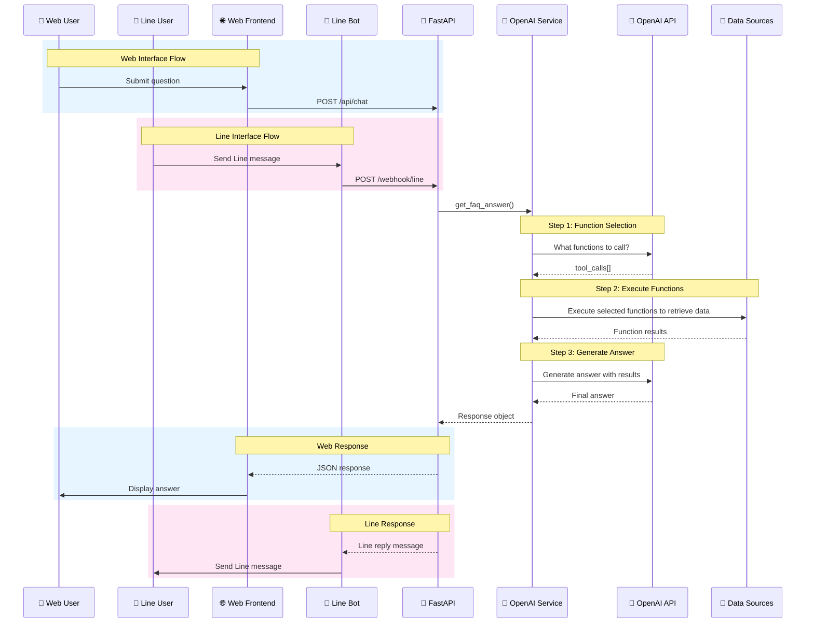

# 🤖 Enhanced FAQ Chatbot with Dual Interfaces

A robust, production-ready FAQ chatbot powered by OpenAI's function-calling capabilities and built with FastAPI. The chatbot provides intelligent responses through **two interfaces**: a **web chat interface** and a **Line messaging bot**, both accessing the same core AI services.

## 🌟 Features
- **Intelligent Question Classification**: Automatically routes questions to appropriate knowledge sources using OpenAI function calling
  - 📚 **FAQ Integration**: FAQ text files (Sales, Labs, Reports)
  - 📊 **Database Querying**: Pathogen database statistics and organism information

## 🏗️ Architecture Overview



### Core Processing Pipeline

Both interfaces use the same **3-step OpenAI function-calling strategy**:

1. **Function Selection**: OpenAI determines which functions to call based on the question
2. **Function Execution**: Execute selected functions (FAQ lookup, database queries, organism searches)
3. **Answer Generation**: Generate natural language response using function results

## 🚀 Quick Start

### Prerequisites

- Python 3.11+
- OpenAI API key
- Line Channel credentials (for Line bot functionality)

### Installation

1. **Clone and setup the project:**
```bash
git clone <repository-url>
cd FAQbot
python3 -m venv .venv
source .venv/bin/activate  # On Windows: .venv\Scripts\activate
```

2. **Install dependencies:**
```bash
pip install -r requirements.txt
```

3. **Configure environment:**
edit `.env` 

```
# Required
OPENAI_API_KEY=your_openai_api_key_here

# Line Bot Configuration (Required for Line interface)
LINE_CHANNEL_ACCESS_TOKEN=your_line_channel_access_token
LINE_CHANNEL_SECRET=your_line_channel_secret

# Optional (with defaults)
OPENAI_MODEL=gpt-4o
OPENAI_MAX_TOKENS=6000
OPENAI_TEMPERATURE=0.1
```

4. **Run the application:**
```bash
# Development
uvicorn app.main:app --reload

# Production
uvicorn app.main:app --host 0.0.0.0 --port 8000 --workers 4
```

5. **Access the interfaces:**

**Web Interface:**
```
http://localhost:8080
```

**Line Bot Setup:**
1. Create a Line Developer account and Line Bot
2. Get your Channel Access Token and Channel Secret
3. Set the webhook URL to: `https://your-domain.com/webhook/line`
4. Add the credentials to your `.env` file

## 📁 Project Structure

```
FAQbot/
├── app/                    # Main application package
│   ├── models/            # Pydantic data models & schemas
│   ├── services/          # Core business logic services
│   │   ├── openai_service.py    # Central AI orchestration
│   │   ├── faq_service.py       # FAQ content management
│   │   ├── database_service.py  # CSV data operations
│   │   └── line_service.py      # Line bot integration
│   ├── api/              # API routes and endpoints
│   │   └── routes.py           # Web & Line endpoints
│   ├── utils/            # Utilities (logging, exceptions)
│   ├── config.py         # Configuration management
│   └── main.py           # FastAPI application
├── faqs/                 # FAQ content files
│   ├── sales.txt         # Sales FAQ content
│   ├── labs.txt          # Labs FAQ content
│   └── reports.txt       # Reports FAQ content
├── data/                 # Database files
│   └── microbe_database.csv    # Pathogen/organism data
├── frontend/             # Web chat interface
│   ├── templates/        # Jinja2 HTML templates
│   └── static/          # CSS, JavaScript, assets
└── requirements.txt     # Python dependencies
```


### Adding or Deleting New FAQ Categories

1. Create or delete a new `.txt` file in `faqs/` directory (filename becomes the category name)
2. Add or delete a category description to `faqs/categories.json`
3. Restart the application

**Example:**
- Add `faqs/pricing.txt` → Creates "pricing" category
- Add entry in `faqs/categories.json`: `"pricing": "pricing plans, cost estimates, billing"`
